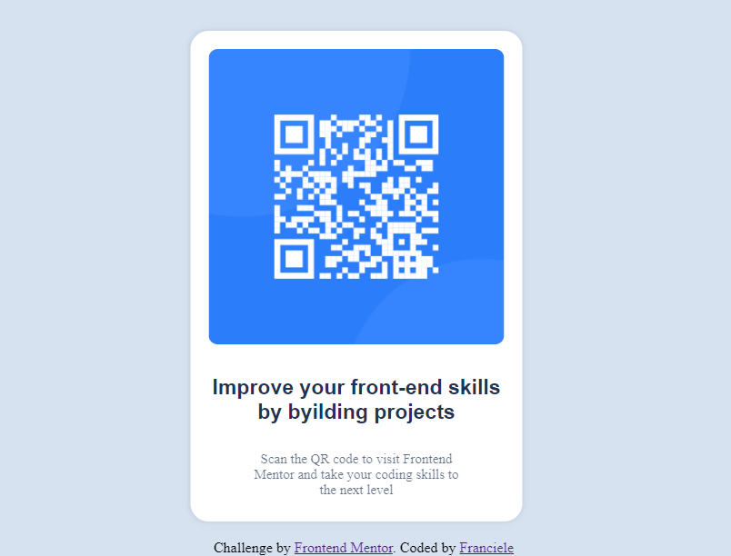

# Frontend Mentor - QR code component solution

## Table of contents

- [Overview](#overview)
  - [Screenshot](#screenshot)
  - [Links](#links)
  - [Built with](#built-with)
- [Author](#author)

## Overview

### Screenshot

### Links

- Solution URL: [Add solution URL here](https://github.com/franszc/QR-code-component-solution)
- Live Site URL: [Add live site URL here](franszc/Desafio-de-componente-de-codigo-QR)

### Built with

- HTML5 markup
- CSS custom properties

## Author

- Frontend Mentor - [@franszc](https://www.frontendmentor.io/profile/franszc)
